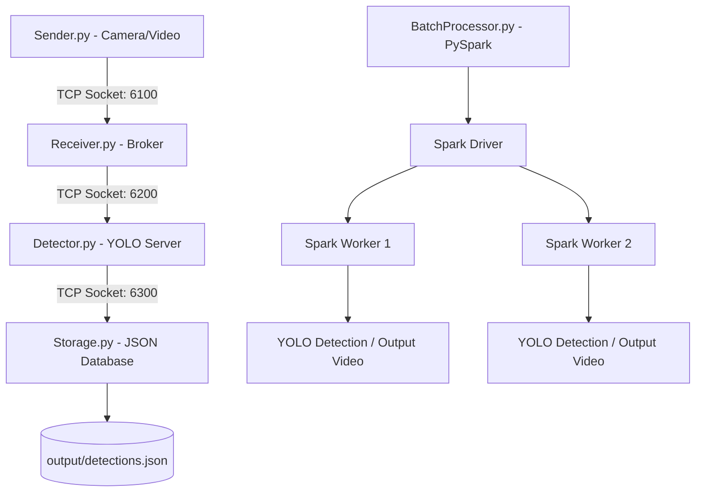
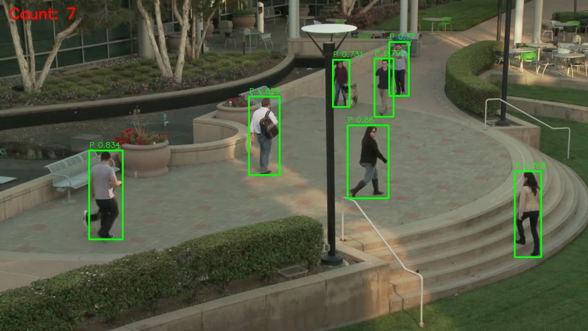
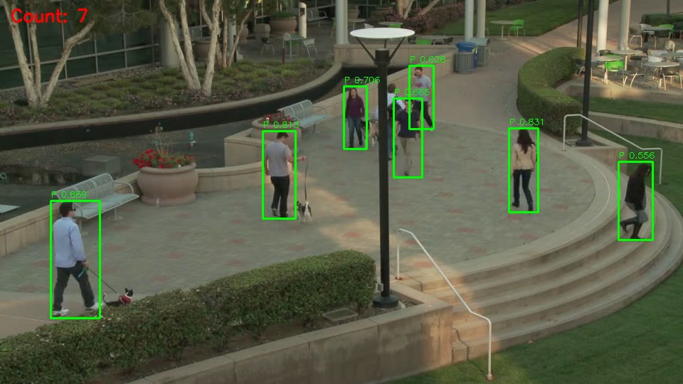

# DS200.Q21.1 – Lab 05: Hệ thống đếm người thời gian thực (Real-Time Person Counting System)

### Thông tin sinh viên:
* **Họ và tên:** Nguyễn Bá Long
* **Mã số sinh viên:** 23520880
* **Lớp:** DS200.Q21.1 – Phân tích dữ liệu lớn
* **Trường:** Đại học Công nghệ Thông tin – UIT

---

## 1. Giới thiệu hệ thống

Hệ thống được thiết kế theo kiến trúc phân tán (Distributed Architecture) nhằm đếm số lượng người hiện diện trong camera thời gian thực và xử lý hàng loạt video bằng công nghệ Dữ liệu lớn (Big Data). Hệ thống bao gồm 4 server giao tiếp độc lập thông qua **TCP Sockets** kết hợp với bộ xử lý phân tán **PySpark** để song song hóa công việc trên các worker.

### Các thành phần chính:
* **Sender (Camera/Video Stream)**: Đọc luồng video hoặc webcam vật lý, trích xuất từng khung hình (frames), nén JPEG, mã hóa Base64 và truyền liên tục qua TCP Socket đến Receiver.
* **Receiver (Message Broker)**: Server trung gian nhận các khung hình từ Sender và chuyển tiếp (forward) chúng sang Detector theo cơ chế bất đồng bộ, giúp giảm tải I/O cho luồng nhận diện.
* **Detector (YOLO Processing)**: Server xử lý trung tâm, sử dụng mô hình nhận diện đối tượng tiên tiến **YOLOv12n** để phát hiện người (class `person`), trích xuất toạ độ bounding box và độ tin cậy, sau đó truyền kết quả dạng JSON sang Storage.
* **Storage (Database/File Writer)**: Server lưu trữ kết quả nhận diện từ Detector, ghi có cấu trúc vào tệp dữ liệu JSON phục vụ phân tích.
* **Batch Processor (PySpark Parallelization)**: Chương trình xử lý song song hàng loạt video bằng PySpark RDD, phân phối công việc nhận diện ra các worker, tự động vẽ khung nhận diện (bounding box), đếm người trực quan và ghi thành video kết quả `.avi` tương thích cao.

---

## 2. Kiến trúc & Luồng dữ liệu



### Định dạng thông điệp truyền tin (Newline-delimited JSON):
Tất cả các thông điệp truyền giữa các server sử dụng định dạng JSON đơn dòng, kết thúc bằng ký tự xuống dòng `\n` để đảm bảo truyền nhận không bị nghẽn:

* **Frame Message (Sender → Receiver → Detector)**:
  ```json
  {"type": "frame", "id": "uuid-v4-string", "no": 1, "ts": "2026-06-14T11:00:00.123", "data": "BASE64_ENCODED_JPEG_STRING"}
  ```
* **Result Message (Detector → Storage)**:
  ```json
  {
    "type": "result", 
    "frame_id": "uuid-v4-string", 
    "frame_no": 1, 
    "ts": "2026-06-14T11:00:00.123",
    "person_count": 3, 
    "method": "YOLO", 
    "ms": 45.2,
    "boxes": [
      {"x": 120, "y": 80, "w": 50, "h": 120, "conf": 0.89}
    ]
  }
  ```

---

## 3. Kết quả trực quan (Result Visualization)

Dưới đây là các khung hình kết quả nhận diện được trích xuất (được vẽ bounding box màu xanh lá và hiển thị số lượng người nhận diện được):

<p align="center">
  
  
</p>

---

## 4. Hướng dẫn cài đặt & Chạy hệ thống

### Bước 1: Khởi tạo môi trường ảo Python
Kích hoạt môi trường ảo để cô lập các thư viện:
```bash
python3 -m venv venv
source venv/bin/activate
```

### Bước 2: Cài đặt các thư viện yêu cầu
Cài đặt PySpark, OpenCV, Ultralytics YOLO và các gói bổ trợ:
```bash
pip install -r requirements.txt
```

### Bước 3: Chạy hệ thống realtime tự động (Demo)
Script tự động khởi chạy cả 4 server (Storage, Detector, Receiver, Sender) và thực hiện nhận diện 150 frames của video:
```bash
python3 src/demo.py --video data/video/pedestrians.mp4 --frames 150
```
Kết quả toạ độ bounding box realtime sẽ được lưu tại: `output/detections.json`.

### Bước 4: Chạy bộ xử lý hàng loạt video bằng PySpark
Đặt các video cần xử lý vào thư mục `data/video/`, sau đó khởi chạy PySpark để song song hóa quá trình nhận diện:
```bash
python3 src/batch_processor.py --no-sahi
```
Sau khi tiến trình chạy xong, kết quả lưu trữ sẽ nằm tại thư mục `output/results/pedestrians/` bao gồm:
* `annotated_pedestrians.avi`: Video kết quả đã vẽ sẵn bounding box (sử dụng codec MJPG chạy mượt trên Windows Media Player).
* `frame_detections.json`: Toạ độ chi tiết các khung nhận diện qua từng khung hình.
* `summary.json`: Báo cáo thống kê số liệu tổng quan của video.
* `report.txt`: File báo cáo văn bản tóm tắt thông số.

---

## 5. Các công nghệ Big Data áp dụng
1. **PySpark RDD (Resilient Distributed Datasets)**: Phân phối danh sách đường dẫn video ra các worker để chạy nhận diện song song, tối ưu hóa thời gian xử lý khi có số lượng video lớn.
2. **PySpark StreamingContext**: Hỗ trợ xử lý dòng dữ liệu realtime theo cơ chế micro-batching.
3. **Decoupled Architecture (TCP Sockets)**: Giảm sự phụ thuộc lẫn nhau giữa các server, tăng khả năng mở rộng (scalability) và khả năng chịu lỗi (fault-tolerance) cho hệ thống phân tán.
