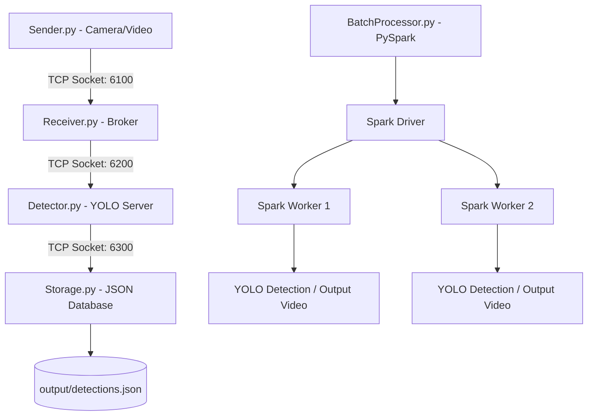

<p align="center">
  <a href="https://www.uit.edu.vn/" title="University of Information Technology">
    
  </a>
</p>

<h1 align="center"><b>DS200.Q21.1 - Phân tích Dữ liệu Lớn — LAB Workspace</b></h1>

---

## 👤 Thông tin sinh viên
- **Họ và tên**: Nguyễn Bá Long
- **Mã số sinh viên**: 23520880
- **Email liên hệ**: 23520880@gm.uit.edu.vn
- **Lớp**: DS200.Q21.1 - Phân tích Dữ liệu Lớn
- **Trường**: Đại học Công nghệ Thông tin - ĐHQG TP.HCM (UIT)
- **GitHub**: [NBasLongz](https://github.com/NBasLongz)

---

## 🎯 Mục tiêu & Tổng quan Workspace
Workspace này lưu trữ toàn bộ mã nguồn, tài liệu và kết quả thực hành của môn học **DS200.Q21.1 - Phân tích Dữ liệu Lớn**. Dự án bao gồm 5 bài Lab lớn đi từ các mô hình lập trình phân tán truyền thống (Hadoop MapReduce) đến các hệ sinh thái Big Data hiện đại (Apache Pig, Apache Spark RDD, Spark DataFrame) và tích hợp trí tuệ nhân tạo thời gian thực (YOLO + PySpark + TCP Socket).

### 🛠️ Các công nghệ & Frameworks chủ chốt
* **Distributed Processing**: Apache Hadoop (HDFS, MapReduce), Apache Spark Core (RDD), Apache Spark SQL (DataFrame).
* **Languages**: Java 11 (Maven built), Python 3.12 (PySpark).
* **Scripting / Querying**: Apache Pig (Pig Latin).
* **Computer Vision**: OpenCV (cv2), Ultralytics YOLOv12 (Object Detection).
* **Networking**: TCP Sockets (Real-time frame streaming).

---

## 📚 Chi tiết các bài Lab

### 📚 Lab 01: Hadoop MapReduce MovieLens Analysis
* **Thư mục**: `DS200.Q21.1.Lab01/`
* **Mục tiêu**: Phân tích hành vi đánh giá phim của người dùng trên tập dữ liệu MovieLens bằng mô hình lập trình MapReduce truyền thống chạy trên nền tảng Hadoop.
* **Ngôn ngữ**: Java 11+
* **Chi tiết các tác vụ đã thực hiện**:
  * **Task 1: Movie Rating Analysis (`MovieRatingAnalysis.java`)**: Tính toán điểm đánh giá trung bình (`AvgRating`) và tổng số lượng đánh giá (`Count`) cho từng bộ phim. Kết quả xuất ra tệp `task1_movie_ratings.txt` dưới định dạng `MovieID | Title | AvgRating | Count`.
  * **Task 2: Genre Rating Analysis (`GenreRatingAnalysis.java`)**: Thống kê điểm đánh giá trung bình và số lượng đánh giá nhóm theo thể loại phim (Genre). Kết quả xuất ra tệp `task2_genre_ratings.txt`.
  * **Task 3: Gender-Based Analysis (`GenderRatingAnalysis.java`)**: Phân tích so sánh hành vi đánh giá giữa người dùng Nam và Nữ trên từng bộ phim cụ thể. Kết quả xuất ra tệp `task3_gender_by_movie.txt` dạng `MovieID | Title | MaleAvg | MaleCount | FemaleAvg | FemaleCount`.
  * **Task 4: Age Group Analysis (`AgeGroupRatingAnalysis.java`)**: Phân nhóm độ tuổi người dùng theo quy định của MovieLens (dưới 18, 18-24, 25-34, 35-44, 45-49, 50-55, 56+) và tính điểm đánh giá trung bình của từng nhóm tuổi đối với mỗi bộ phim. Kết quả xuất ra tệp `task4_age_groups_by_movie.txt`.

---

### 📚 Lab 02: Apache Pig Hotel Review Analysis
* **Thư mục**: `DS200.Q21.1.Lab02/`
* **Mục tiêu**: Làm sạch dữ liệu văn bản phi cấu trúc (Hotel Reviews) và trích xuất đặc trưng ngôn ngữ bằng ngôn ngữ kịch bản Pig Latin chạy trên nền Apache Pig.
* **Tác vụ đã thực hiện**:
  * **Task 1: Text Cleaning & Tokenization (`bai1.pig`)**: Chuyển đổi toàn bộ review văn bản sang chữ thường (lowercase), phân tách câu thành các từ đơn (tokenization), lọc bỏ các từ dừng thông dụng (`stopwords.txt`) và làm sạch các kí tự đặc biệt.
  * **Task 2: Word Frequency (`bai2.pig`)**: Thống kê tần suất xuất hiện của các từ đơn sau khi làm sạch, lọc ra các từ có tần suất lớn hơn 500 lần. Đồng thời đếm số lượng Review theo từng danh mục (`Category`) và khía cạnh (`Aspect`).
  * **Task 3: Sentiment Analysis (`bai3.pig`)**: Phân tích sắc thái cảm xúc (`positive`/`negative`) tương ứng với từng khía cạnh dịch vụ khách sạn (`Aspect`).
  * **Task 4: Advanced Filtering & Grouping (`bai4.pig`)**: Lọc dữ liệu đa điều kiện và nhóm dữ liệu nâng cao dựa trên các chỉ số cảm xúc của khách hàng.
  * **Task 5: Multi-level Aggregation (`bai5.pig`)**: Thực hiện các phép tổng hợp đa cấp và sắp xếp dữ liệu để xuất báo cáo cuối cùng.

---

### 📚 Lab 03: Apache Spark RDD MovieLens Analysis
* **Thư mục**: `DS200.Q21.1.Lab03/`
* **Mục tiêu**: Thực hiện lại các bài toán phân tích MovieLens của Lab 01 nhưng sử dụng bộ xử lý tính toán phân tán trong bộ nhớ **Apache Spark Core (RDD API)** giúp tối ưu hoá hiệu năng gấp nhiều lần so với MapReduce.
* **Song song hai giải pháp**:
  1. **Java Spark RDD (Mã nguồn chính)**: Tổ chức mã nguồn hướng đối tượng trong thư mục `src/`, quản lý build qua Maven (`pom.xml`), chạy thông qua lệnh đóng gói JAR và `spark-submit`.
  2. **Python PySpark RDD (Mã nguồn bổ sung)**: Nằm tại thư mục `Python_Solutions/`, triển khai các Task bằng kịch bản Python độc lập sử dụng PySpark RDD.
* **Chi tiết các tác vụ đã thực hiện**:
  * **Task 1: Movie Ratings with Threshold (`task1_movie_ratings`)**: Tính trung bình đánh giá của từng phim, chỉ giữ lại các phim có tổng số đánh giá lớn hơn ngưỡng $N$ quy định.
  * **Task 2: Genre Ratings (`task2_genre_ratings`)**: Phân tích điểm đánh giá trung bình và số lượt đánh giá theo thể loại phim.
  * **Task 3: Gender Demographics (`task3_gender_by_movie`)**: Tính toán và so sánh chi tiết điểm trung bình của Nam và Nữ trên từng phim.
  * **Task 4: Age Group Ratings (`task4_age_groups_by_movie`)**: Thống kê điểm đánh giá trung bình nhóm theo các nhóm tuổi người dùng.
  * **Task 5: Occupation Ratings (`task5_occupation_ratings`)**: Phân tích điểm đánh giá phim dựa trên nghề nghiệp của người dùng (`occupation.txt`).
  * **Task 6: Yearly Rating Trends (`task6_yearly_ratings`)**: Trích xuất năm từ timestamp của đánh giá và phân tích xu hướng đánh giá trung bình thay đổi qua từng năm (từ 2022 đến 2024).

---

### 📚 Lab 04: Apache Spark DataFrame E-Commerce Analytics
* **Thư mục**: `DS200.Q21.1.Lab04/`
* **Mục tiêu**: Phân tích hành vi mua sắm và hiệu suất giao hàng của trang thương mại điện tử Fecom Inc. (Đức) bằng **Spark DataFrame API** - giúp tối ưu hoá truy vấn nhờ Catalyst Optimizer.
* **Song song hai giải pháp**:
  1. **Java Spark DataFrame (Mã nguồn chính)**: Nằm trong thư mục `spark/src/`, biên dịch thành JAR và chạy qua `spark-submit`.
  2. **Python PySpark DataFrame (Mã nguồn bổ sung)**: Nằm trong thư mục `Python_Solutions_Lab04/` (chạy tối ưu hóa trên Colab, xử lý triệt để lỗi ký tự BOM `\uFEFF` ở header và lỗi ngắt dòng của review bằng cơ chế `multiLine`).
* **Chi tiết các tác vụ đã thực hiện**:
  * **Task 1: Dataset Loader**: Tải dữ liệu từ 5 file CSV ngăn cách bằng dấu chấm phẩy (`;`), tự suy luận Schema, xử lý làm sạch tiêu đề cột bị dính BOM UTF-8. Xuất schema chi tiết và số dòng của từng DataFrame.
  * **Task 2: Overall Statistics**: Thống kê số lượng đơn hàng duy nhất, số khách hàng độc nhất, số người bán và thực hiện kiểm tra chất lượng dữ liệu (Data Quality Checks).
  * **Task 3: Orders by Country**: Phân tích số lượng đơn hàng theo quốc gia đặt hàng, sắp xếp giảm dần theo lượng đơn hàng.
  * **Task 4: Orders by Year & Month**: Trích xuất thời gian, nhóm đơn hàng theo Năm và Tháng, sắp xếp Năm tăng dần và Tháng giảm dần.
  * **Task 5: Review Score Statistics**: Cast điểm đánh giá về kiểu Integer, lọc bỏ các dòng Null/Outliers (chỉ giữ điểm từ 1 đến 5), tính điểm trung bình (làm tròn 4 chữ số thập phân), xây dựng bảng phân phối đầy đủ từ 1 đến 5 điểm (điền 0 nếu không có đánh giá).
  * **Task 6: 2024 Revenue by Product Category**: Tính doanh thu (`Revenue = Price + Freight_Value`) trong năm 2024, nhóm theo danh mục sản phẩm (thay thế Null bằng `'Unknown'`), thống kê tổng doanh thu (làm tròn 2 chữ số thập phân), số đơn hàng và số sản phẩm đã bán.
  * **Task 8: Delivery Performance**: Tính toán hiệu số ngày giao hàng thực tế và ngày hạn giao hàng dự kiến dưới dạng số thực (`Delay_Days`), phân loại đơn hàng thành `Early` (giao sớm), `On_Time` (đúng hạn) hoặc `Late` (giao trễ). Thống kê tổng số lượng sản phẩm, độ trễ trung bình/nhỏ nhất/lớn nhất của mỗi nhóm và liệt kê Top 50 sản phẩm bị giao trễ nặng nhất.
  * **Task 9: Customer Segmentation**: Phân nhóm khách hàng dựa trên các thuộc tính: Số đơn hàng (`Order_Count`), Giá trị trung bình đơn (`Avg_Order_Value`), Tổng số tiền chi tiêu (`Total_Spent`) và Tần suất mua sắm trong 30 ngày. Phân loại khách hàng thành 4 nhóm: `High_Value_Loyal` (VIP), `Loyal`, `Big_Spender`, `Occasional` và xuất thống kê doanh thu theo phân khúc.

---

### 📚 Lab 05: YOLO + PySpark Distributed Real-time Person Counting
* **Thư mục**: `DS200.Q21.1.Lab05/`
* **Mục tiêu**: Xây dựng hệ thống phân tán phát hiện và đếm số lượng người thời gian thực từ camera hoặc luồng video, kết hợp xử lý lô song song trên tập tin video lớn bằng Spark.
* **Kiến trúc luồng truyền tin (Real-time Pipeline via TCP Sockets)**:
  1. **Sender (`sender.py`)**: Đọc webcam hoặc video, nén frame thành JPEG, chuyển sang Base64 và truyền qua cổng TCP `6100`.
  2. **Receiver (`receiver.py`)**: Broker tiếp nhận dữ liệu frame từ Sender và phân phối bất đồng bộ sang Detector qua cổng TCP `6200`.
  3. **Detector (`detector.py`)**: Xử lý trung tâm, nạp frame vào mô hình **YOLOv12n** để nhận diện đối tượng người (`class 0: person`), trích xuất toạ độ bounding box và truyền kết quả JSON sang Storage qua cổng TCP `6300`.
  4. **Storage (`storage.py`)**: Lắng nghe cổng TCP `6300` và ghi nhận kết quả lưu trữ có cấu trúc vào cơ sở dữ liệu `output/detections.json`.
  5. **Batch Processor (`batch_processor.py`)**: Sử dụng **PySpark RDD** để phân phối công việc xử lý nhận diện người song song trên nhiều tập tin video lớn, vẽ khung bounding box trực quan lên từng frame và xuất video kết quả dưới định dạng `.avi` tốc độ cao.



---

## 📂 Cấu trúc thư mục chi tiết của Workspace
```text
DS200.Q21.1.LAB/ (Root)
├── Readme.md                           # Tài liệu tổng quan workspace (tệp tin này)
├── Slides_Refer/                       # Tài liệu tham khảo, slide bài giảng môn học
│
├── DS200.Q21.1.Lab01/                  # LAB 01: Hadoop MapReduce
│   ├── Data/                           # Tập dữ liệu đầu vào MovieLens
│   ├── Scripts/                        # Script bash để chạy MapReduce
│   ├── Notebook/                       # Notebook nháp kiểm tra
│   ├── BaiTap/                         # File đề bài yêu cầu
│   └── Readme.md                       # Hướng dẫn chi tiết chạy Lab 01
│
├── DS200.Q21.1.Lab02/                  # LAB 02: Apache Pig
│   ├── Data/                           # Tập dữ liệu hotel reviews và stopwords
│   ├── Source_Pig/                     # Kịch bản Pig Latin (bai1.pig -> bai5.pig)
│   ├── Result/                         # Thống kê kết quả cuối cùng
│   └── Readme.md                       # Hướng dẫn chi tiết chạy Lab 02
│
├── DS200.Q21.1.Lab03/                  # LAB 03: Apache Spark RDD
│   ├── Data/                           # Tập dữ liệu MovieLens
│   ├── src/                            # Source code Java Spark RDD (Task 1 -> Task 6)
│   ├── Python_Solutions/               # Kịch bản PySpark RDD thay thế (Task 1 -> Task 6)
│   ├── Output/                         # Báo cáo kết quả dạng văn bản (.txt)
│   ├── pom.xml                         # File cấu hình dependencies Maven
│   └── Readme.md                       # Hướng dẫn chi tiết chạy Lab 03
│
├── DS200.Q21.1.Lab04/                  # LAB 04: Apache Spark DataFrame
│   ├── data/                           # Dữ liệu khách hàng & đơn hàng e-commerce
│   ├── spark/                          # Dự án Java Spark DataFrame (Task 1 -> Task 9)
│   ├── Python_Solutions_Lab04/         # Kịch bản PySpark DataFrame Colab (Task 1 -> Task 9)
│   ├── output/                         # Báo cáo thống kê kết quả xuất bản dạng bảng
│   └── README.md                       # Hướng dẫn chi tiết chạy Lab 04
│
└── DS200.Q21.1.Lab05/                  # LAB 05: YOLO + PySpark Real-time Counting
    ├── src/                            # Source code hệ thống phân tán Socket + YOLO
    │   ├── config.py / sender.py / receiver.py / detector.py / storage.py / batch_processor.py
    ├── data/                           # Video mẫu chạy thử nghiệm
    ├── output/                         # Dữ liệu detections.json và video kết quả trực quan
    └── README.md                       # Hướng dẫn chi tiết chạy Lab 05
```

---

## 🚀 Hướng dẫn cài đặt và Khởi chạy nhanh

### Yêu cầu hệ thống tối thiểu:
* **Hệ điều hành**: Linux (Ubuntu 20.04 LTS trở lên / WSL2 trên Windows).
* **JDK**: OpenJDK 11.
* **Python**: Python 3.10 trở lên.
* **Hadoop**: Apache Hadoop 3.3.x.
* **Spark**: Apache Spark 3.5.x.

### 1. Thực thi Hadoop MapReduce (Lab 01):
```bash
cd DS200.Q21.1.Lab01
chmod +x Scripts/*.sh
./Scripts/run_all_hadoop_jobs.sh
```

### 2. Thực thi Apache Pig (Lab 02):
```bash
cd DS200.Q21.1.Lab02
# Chạy local mode cho bài 1
pig -x local Source_Pig/bai1.pig
```

### 3. Thực thi Spark RDD Java (Lab 03):
```bash
cd DS200.Q21.1.Lab03
mvn clean package -DskipTests
cd scripts
bash run_all.sh
```

### 4. Thực thi Spark DataFrame Java & Python (Lab 04):
* **Chạy mã nguồn Java**:
  ```bash
  cd DS200.Q21.1.Lab04
  ./scripts/run_all.sh
  ```
* **Chạy kịch bản PySpark trên Google Colab**: Nạp mã nguồn trong thư mục `Python_Solutions_Lab04/` lên notebook của bạn, cấu hình Java 17 và trỏ đường dẫn đến thư mục `data/` chứa các tệp tin CSV của Lab 04.

### 5. Thực thi hệ thống phát hiện người thời gian thực (Lab 05):
```bash
cd DS200.Q21.1.Lab05
# Kích hoạt venv và cài đặt thư viện
python3 -m venv venv
source venv/bin/activate
pip install -r requirements.txt

# Khởi chạy demo real-time socket kết hợp YOLOv12
python3 src/demo.py --video data/video/pedestrians.mp4 --frames 150

# Khởi chạy PySpark xử lý song song phân tán hàng loạt video
python3 src/batch_processor.py --no-sahi
```

---

## 📜 Giấy phép & Bản quyền
Bản quyền workspace thuộc về sinh viên **Nguyễn Bá Long (23520880)**, được phát triển phục vụ cho môn học **DS200.Q21.1 - Phân tích Dữ liệu Lớn** tại trường Đại học Công nghệ Thông tin (UIT). Nghiêm cấm mọi hành vi sao chép nguyên bản phục vụ mục đích gian lận học thuật.

**Cập nhật lần cuối**: 21 tháng 7, 2026.  
**Trạng thái**: Hoàn thành xuất sắc toàn bộ 5 Labs và kiểm thử thành công.
